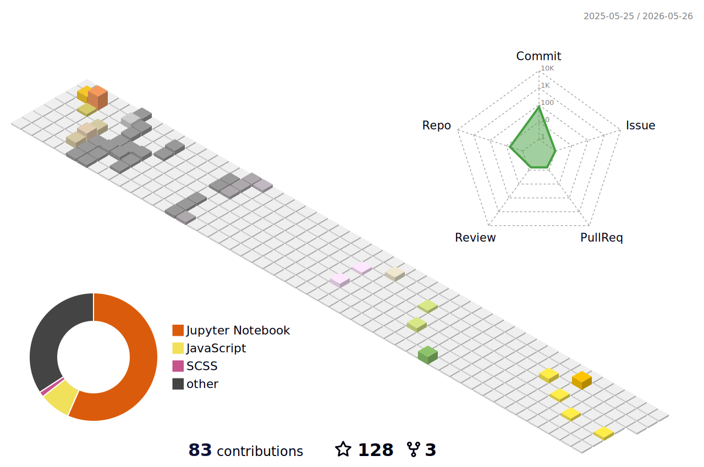

  

# 🌟 Introduction

- 🏠 Welcome to my GitHub homepage

- 🏫 I'm working on my Master's degree in Computer Science at ➡️ 

- 📖 I've completed my undergraduate studies at ➡️ 

- 📑 I'm currently focusing on Generative Models, with a particular emphasis on the application across LiDAR point clouds

- 🌍 Visit **[my academic page](https://bonjour-npy.github.io/academic-page/)**

- 📒 Visit **[my blog](https://bonjour-npy.github.io)**

# 🔥 News

- 🎉 Feb, 2026: Our paper “Structure-to-Intensity Diffusion for Adverse-Weather LiDAR Generation” has been accepted by CVPR.

# 📊 Streak Stats

  

# ⚒️ Recent Commits

  

